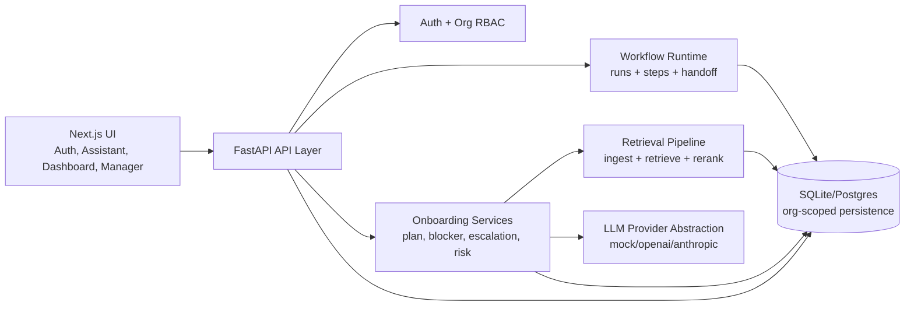

# OnboardAI
### Agentic Developer Onboarding Assistant

[](https://www.python.org/)
[](https://fastapi.tiangolo.com/)
[](https://nextjs.org/)
[](https://www.typescriptlang.org/)

OnboardAI is a modern onboarding copilot that acts like a workflow agent, not just a chat bot.

It helps new hires move from day-1 confusion to productive ramp-up using org-aware context, grounded answers, blocker handling, escalation support, and manager-level visibility.

---

## Key wins

- Built a true agentic loop: plan, retrieve, decide, escalate, and track.
- Added multi-tenant foundations: auth, organizations, role-aware access, scoped data.
- Integrated provider-swappable LLM synthesis with grounded citation fallback.
- Implemented explicit workflow execution with run and step observability.
- Delivered manager-facing analytics with explainable onboarding risk scoring.

---

## At a glance

| Area | What it does |
|---|---|
| Auth + tenancy | Multi-user login, org/workspace isolation, role-aware access |
| Onboarding engine | Personalized plans, access tracking, task dependencies |
| Grounded AI | Retrieval + LLM synthesis with source citations and fallback |
| Agent workflow | Explicit runs/steps for question, blocker, and onboarding flows |
| Manager analytics | Team/org dashboard + explainable risk scoring |
| Evaluation | Retrieval, classification, and recommendation quality endpoints |

---

## Why this is agentic (not just RAG)

OnboardAI follows a stateful decision loop:

1. **Load context**: user + org + role + onboarding state.
2. **Plan**: generate structured tasks with dependencies.
3. **Retrieve + synthesize**: ground responses in docs and compose answers.
4. **Adapt**: detect blockers, classify type/severity, suggest next action.
5. **Escalate**: draft routed messages to the right team/owner.
6. **Orchestrate**: persist workflow runs and step outcomes.
7. **Supervise**: manager dashboard + risk scoring over time.

---

## Architecture snapshot



---

## Core capabilities

- Org-aware authentication (`signup`, `login`) and scoped data access
- Role/team-based onboarding plan generation
- Grounded chat with citations and low-confidence fallback
- Provider-swappable LLM abstraction (`mock`, `openai`, `anthropic`)
- Blocker classification and explanation endpoints
- Escalation drafting for Slack/email-style communication
- Workflow runtime with run/step tracking and handoff endpoint
- Manager dashboard with explainable risk factors
- Evaluation suite for retrieval, classification, and recommendations

---

## Tech stack

- **Frontend**: Next.js (App Router), TypeScript, Tailwind CSS
- **Backend**: FastAPI, SQLAlchemy, Pydantic
- **Workflow**: explicit node-based orchestration (LangGraph-compatible design)
- **RAG**: TF-IDF retrieval + reranking
- **LLM integration**: provider abstraction + deterministic fallback
- **Persistence**: SQLite default, Postgres-ready via `DATABASE_URL`
- **Artifacts**: `storage/app.db`, `storage/rag_index.pkl`

---

## Project structure

```text
backend/     API, auth, org scoping, services, agent runtime, eval, scripts
frontend/    Auth, intake, assistant, dashboard, manager views
data/        Structured + unstructured onboarding knowledge
storage/     Runtime artifacts (DB + retrieval index)
docs/        Architecture, API contract, demo script
```

---

## Quick start

### Backend

```bash
python -m pip install -r backend/requirements.txt
python backend/scripts/init_db.py
python backend/scripts/ingest_docs.py
uvicorn backend.app.main:app --reload
```

- API: `http://127.0.0.1:8000`
- Docs: `http://127.0.0.1:8000/docs`

`backend/.env.example` includes DB and JWT settings:
- `DATABASE_URL`
- `JWT_SECRET_KEY`
- `JWT_ALGORITHM`
- `ACCESS_TOKEN_EXPIRE_MINUTES`

### Frontend

```bash
cd frontend
npm install
npm run dev
```

- App: `http://localhost:3000`

---

## Smoke tests

```bash
python backend/scripts/init_db.py
python backend/scripts/ingest_docs.py
python backend/scripts/smoke_test.py
python backend/scripts/rag_smoke_test.py
```

Coverage includes:
- auth/org bootstrap
- scoped onboarding flows
- blocker + escalation path
- grounded chat path
- manager dashboard endpoints

---

## API surface (highlights)

### Auth and organizations
- `POST /auth/signup`
- `POST /auth/login`
- `POST /organizations`
- `GET /organizations/{org_id}`
- `POST /organizations/{org_id}/members`
- `GET /organizations/{org_id}/members`
- `POST /organizations/{org_id}/teams`
- `GET /organizations/{org_id}/teams`
- `POST /organizations/{org_id}/llm/config`
- `GET /organizations/{org_id}/llm/config`

### Onboarding and blocker handling
- `POST /users`
- `GET /users/{user_id}`
- `POST /users/{user_id}/access`
- `GET /users/{user_id}/access`
- `POST /users/{user_id}/plan/generate`
- `GET /users/{user_id}/plan`
- `POST /users/{user_id}/chat`
- `POST /users/{user_id}/chat/answer`
- `POST /users/{user_id}/blockers`
- `POST /users/{user_id}/blockers/{blocker_id}/explain`
- `POST /users/{user_id}/escalation-draft`
- `GET /users/{user_id}/progress`
- `PATCH /tasks/{task_id}`

### Workflow runtime
- `POST /users/{user_id}/workflows/onboarding-run`
- `POST /users/{user_id}/workflows/question-run`
- `POST /users/{user_id}/workflows/blocker-run`
- `GET /workflows/{run_id}`
- `POST /workflows/{run_id}/handoff`

### Manager and evaluation
- `GET /organizations/{org_id}/dashboard`
- `GET /organizations/{org_id}/dashboard/blockers`
- `GET /teams/{team_id}/dashboard`
- `GET /users/{user_id}/risk`
- `POST /users/{user_id}/risk/recompute`
- `POST /eval/retrieval/run`
- `POST /eval/classification/run`
- `POST /eval/recommendation/run`
- `GET /eval/summary`

---

## Demo flow (5-8 minutes)

1. Sign up as admin and create org context.
2. Create a new hire and generate onboarding plan.
3. Ask questions and show grounded, cited responses.
4. Log a blocker and show explanation + next action.
5. Generate escalation draft.
6. Run a workflow endpoint and inspect step logs.
7. Open manager dashboard and risk output.

---

## Notes

- Local setup defaults to SQLite for speed.
- Postgres is enabled through `DATABASE_URL`.
- `mock` LLM provider is default for deterministic local demos.

## Docs

- `docs/architecture.md`
- `docs/api_contract.md`
- `docs/demo_script.md`

