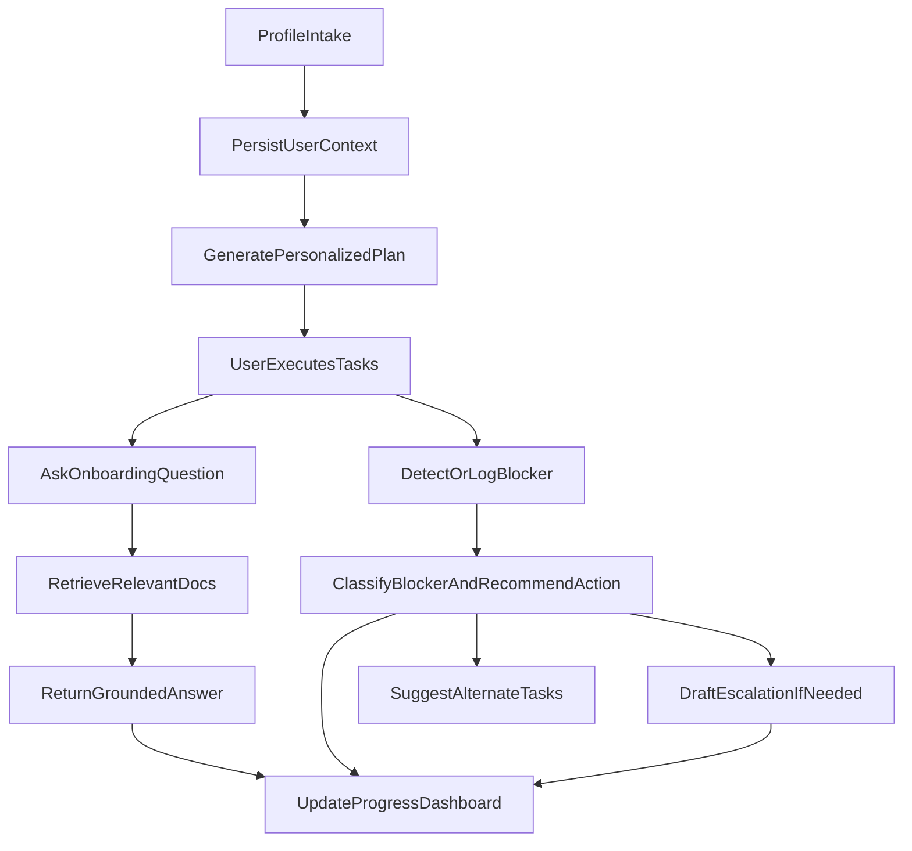

# Architecture Overview

## Goal

OnboardAI is designed to show an agentic onboarding workflow where system behavior adapts based on persisted context and blockers.

## System components

- **Frontend (`frontend/`)**
  - Intake UI for profile + access status capture
  - Assistant UI for onboarding Q&A
  - Dashboard UI for plan progress and blocker visibility

- **Backend (`backend/app/`)**
  - FastAPI routes by domain (`users`, `access`, `plan`, `chat`, `blockers`, `progress`, `escalation`)
  - SQLAlchemy models and SQLite persistence
  - Service layer for planning, blocker intelligence, escalation drafting, chat synthesis
  - Structured data loaders for requirements/templates/playbooks/contact directory
  - Retrieval pipeline for unstructured onboarding docs

- **Knowledge assets (`data/`)**
  - `data/structured`: role/team requirements, templates, blocker playbooks, contacts
  - `data/unstructured`: markdown onboarding guides and runbooks

- **Runtime storage (`storage/`)**
  - `app.db`: transactional onboarding state
  - `rag_index.pkl`: retrieval index built from onboarding docs

## Agentic flow

## Data model

Core tables:

- `users`
- `user_access_status`
- `tasks`
- `blockers`
- `interactions`
- `documents`

Design intent:

- `users` + `user_access_status` store onboarding context and prerequisites
- `tasks` + `depends_on_task_id` capture deterministic plan graph
- `blockers` stores current friction and recommended resolution metadata
- `interactions` captures cross-session memory of system/user exchanges
- `documents` tracks source metadata for retrieval corpus

## Retrieval architecture

1. Ingestion script chunks markdown docs from `data/unstructured`
2. Vectorization builds retrieval index in `storage/rag_index.pkl`
3. Chat route retrieves top chunks by semantic similarity
4. Response synthesizer returns role/team-aware guidance + source citations

Notes:

- V1 uses TF-IDF retrieval for local simplicity and deterministic setup
- Embedder/retriever are isolated so dense embeddings + vector DB can be swapped later

## Blocker + escalation architecture

- Blocker classification is rule-guided via `blocker_playbooks.json`
- Recommended next action and alternate tasks come from playbook category
- Escalation routing resolves correct owner/team via:
  - blocker category -> `default_escalation_team`
  - contact directory -> `owner_name`, `slack_channel`, `email`
- Escalation drafts can be generated as Slack or email format

## Tradeoffs (V1)

- **Chosen**: practical deterministic logic + persisted state + retrieval grounding
- **Deferred**: full orchestration graph runtime, auth, multi-user roles, enterprise integrations

